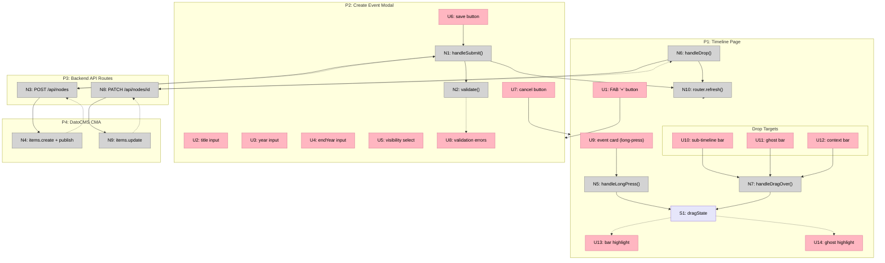

# Timeline Editing — Shaping

## Source

> Voglio poter fare due azioni lato UI:
>
> 1. **Creare un evento direttamente da timeline** mentre sto navigando. Un float button apre un modale in cui inserire solo: titolo, anno di inizio, anno di fine, visibilità. Quando salvo, il parent del nuovo record viene impostato con il parent reale del nodo.
>
> 2. **Drag & drop di un evento** per spostarlo in una timeline differente.

---

## Problem

Oggi per aggiungere o spostare eventi bisogna andare su DatoCMS, trovare il modello giusto, impostare il parent manualmente. Questo interrompe il flusso di esplorazione e rende la creazione di contenuto un'attività separata dalla navigazione.

## Outcome

Mentre navigo una timeline posso creare eventi al volo e riorganizzarli tra contesti con drag & drop, senza uscire dall'interfaccia.

---

## Requirements (R)

| ID | Requirement | Status |
|----|-------------|--------|
| R0 | Creare un evento da timeline con: titolo, anno inizio, anno fine, visibilità | Core goal |
| R1 | Il parent del nuovo evento è il contesto attualmente navigato | Core goal |
| R2 | Dopo il salvataggio, l'evento appare immediatamente sulla timeline | Core goal |
| R3 | Drag & drop di un evento per spostarlo in un altro contesto | Core goal |
| R4 | Il drag & drop aggiorna il parent dell'evento su DatoCMS | Core goal |
| R5 | Token CMA in env, no auth UI per ora (tool personale) | Must-have |
| R6 | Validazione: titolo obbligatorio, anno obbligatorio | Must-have |
| R7 | Drop target: qualsiasi timeline bar (sub-timeline, ghost, context bar) | Must-have |
| R8 | Highlight della barra target durante il drag hover | Must-have |
| R9 | Dopo drag & drop, la timeline si aggiorna senza reload | Must-have |

---

## A: API Routes + Client Mutations

Un unico shape con due meccaniche UI indipendenti che condividono lo strato API.

| Part | Meccanismo | Flag |
|------|-----------|:----:|
| **A1** | **API layer (shared)** | |
| A1.1 | Token CMA in `DATOCMS_CMA_TOKEN` env var | |
| A1.2 | `POST /api/nodes` — crea un nodo su DatoCMS via `client.items.create()`, ritorna il record creato | |
| A1.3 | `PATCH /api/nodes/[id]` — aggiorna un nodo (es. parent) via `client.items.update()`, ritorna il record aggiornato | |
| **A2** | **Creazione evento (FAB + modale)** | |
| A2.1 | FAB "+" visibile sulla timeline (accanto a ZoomControls) | |
| A2.2 | Click FAB → modale con form: titolo, anno inizio, anno fine (opzionale), visibilità (select: regular/main/super) | |
| A2.3 | Submit → `POST /api/nodes` con `{ title, year, endYear, visibility, parent: currentNodeId }` | |
| A2.4 | On success: `router.refresh()` per ricaricare i dati server-side → evento appare sulla timeline | |
| **A3** | **Drag & drop tra contesti** | |
| A3.1 | Le event card (`SuperEventMarker`) diventano draggabili (HTML drag o pointer events) | |
| A3.2 | Le barre timeline (SubTimelineBars, GhostBars, TimelineBar) diventano drop target | |
| A3.3 | Hover su drop target → highlight visivo (stroke più spesso, colore acceso) | |
| A3.4 | Drop → `PATCH /api/nodes/[eventId]` con `{ parent: targetContextId }` | |
| A3.5 | On success: `router.refresh()` → evento sparisce dal contesto originale, appare nel nuovo | |

---

## Fit Check: R × A

| Req | Requirement | Status | A |
|-----|-------------|--------|---|
| R0 | Creare evento con titolo, anno inizio, anno fine, visibilità | Core goal | ✅ |
| R1 | Parent = contesto attualmente navigato | Core goal | ✅ |
| R2 | Evento appare immediatamente dopo salvataggio | Core goal | ✅ |
| R3 | Drag & drop per spostare evento in altro contesto | Core goal | ✅ |
| R4 | D&D aggiorna parent su DatoCMS | Core goal | ✅ |
| R5 | Token CMA in env, no auth UI | Must-have | ✅ |
| R6 | Validazione: titolo e anno obbligatori | Must-have | ✅ |
| R7 | Drop su qualsiasi barra timeline (sub, ghost, context) | Must-have | ✅ |
| R8 | Highlight barra target durante drag hover | Must-have | ✅ |
| R9 | Timeline si aggiorna senza reload dopo D&D | Must-have | ✅ |

A passa tutto. Shape semplice, un solo approccio credibile.

---

## Decisioni tecniche

**D1 — Drag:** Long-press sulla card attiva il drag mode. Tap normale = seleziona evento. Pointer events (già nel canvas per pan).

**D2 — Refresh:** `router.refresh()` dopo create/move — ricava i dati freschi dal server, semplice e affidabile.

**D3 — Slug:** Generato lato API route con `slugify(title)`. DatoCMS non lo genera automaticamente via API.

---

## Breadboard

### Places

| # | Place | Description |
|---|-------|-------------|
| P1 | Timeline Page | La vista timeline di un contesto (`/timeline/[slug]`) |
| P2 | Create Event Modal | Modale sovrapposto alla timeline per creare un evento |
| P3 | Backend (API Routes) | Next.js API routes che parlano con DatoCMS CMA |
| P4 | DatoCMS | Content Management API (scrittura) |

### UI Affordances

| # | Place | Component | Affordance | Control | Wires Out | Returns To |
|---|-------|-----------|------------|---------|-----------|------------|
| U1 | P1 | TimelineCanvas | FAB "+" button | click | → P2 | — |
| U2 | P2 | CreateEventModal | title input | type | — | — |
| U3 | P2 | CreateEventModal | year input | type | — | — |
| U4 | P2 | CreateEventModal | endYear input | type | — | — |
| U5 | P2 | CreateEventModal | visibility select (regular/main/super) | select | — | — |
| U6 | P2 | CreateEventModal | save button | click | → N1 | — |
| U7 | P2 | CreateEventModal | cancel button | click | → P1 | — |
| U8 | P2 | CreateEventModal | validation errors | render | — | — |
| U9 | P1 | SuperEventMarker | event card (draggable) | long-press | → N5 | — |
| U10 | P1 | SubTimelineBars | bar (drop target) | drag-over | → N7 | — |
| U11 | P1 | GhostBars | ghost bar (drop target) | drag-over | → N7 | — |
| U12 | P1 | TimelineCanvas | context bar (drop target) | drag-over | → N7 | — |
| U13 | P1 | SubTimelineBars | bar highlight on drag hover | render | — | — |
| U14 | P1 | GhostBars | ghost bar highlight on drag hover | render | — | — |

### Code Affordances

| # | Place | Component | Affordance | Control | Wires Out | Returns To |
|---|-------|-----------|------------|---------|-----------|------------|
| N1 | P2 | CreateEventModal | `handleSubmit()` — valida form, chiama API | call | → N2, → N3 | — |
| N2 | P2 | CreateEventModal | `validate()` — titolo e anno obbligatori | call | — | → U8 |
| N3 | P3 | POST /api/nodes | `createNode()` — crea record via CMA | call | → N4 | → N1 |
| N4 | P4 | DatoCMS CMA | `client.items.create()` + `client.items.publish()` | call | — | → N3 |
| N5 | P1 | SuperEventMarker | `handleLongPress()` — attiva drag mode dopo 500ms | call | → S1 | — |
| N6 | P1 | TimelineCanvas | `handleDrop()` — legge eventId e targetId, chiama API | call | → N8 | — |
| N7 | P1 | TimelineCanvas | `handleDragOver()` — setta dropTargetId nello stato | call | — | → U13, U14 |
| N8 | P3 | PATCH /api/nodes/[id] | `updateNode()` — aggiorna parent via CMA | call | → N9 | → N6 |
| N9 | P4 | DatoCMS CMA | `client.items.update()` | call | — | → N8 |
| N10 | P1 | page.tsx | `router.refresh()` — ricarica dati server-side | call | — | → P1 |

### Data Stores

| # | Place | Store | Description |
|---|-------|-------|-------------|
| S1 | P1 | `dragState` | `{ dragging: boolean, eventId: string \| null, dropTargetId: string \| null }` |
| S2 | P1 | `currentNodeId` | ID del contesto attualmente navigato (già esistente, dal server) |

### Wiring Notes

**Create flow:** U1 → P2 → U2-U5 (form) → U6 → N1 → N2 (validate) → N3 (API) → N4 (CMA) → N10 (refresh) → P1 aggiornato

**Drag & drop flow:** U9 (long-press) → N5 → S1.dragging=true → (user drags) → U10/U11/U12 (drag-over) → N7 → S1.dropTargetId → U13/U14 (highlight) → (user drops) → N6 → N8 (API) → N9 (CMA) → N10 (refresh) → P1 aggiornato

**Existing system connections:**
- `SuperEventMarker` già ha `onClick` e `onHover` — long-press si aggiunge accanto (pointer events)
- `SubTimelineBars` e `GhostBars` già hanno `pointerEvents: 'auto'` sulle barre — si aggiungono `onDragOver`/`onDrop`
- `ZoomControls` rimane invariato — FAB è un componente separato posizionato accanto
- `router.refresh()` non è attualmente usato nel progetto ma è un meccanismo standard di Next.js App Router

---

## Slices

| # | Slice | Mechanism | Affordances | Demo |
|---|-------|-----------|-------------|------|
| V1 | API layer + Create event | A1, A2 | U1-U8, N1-N4, N10, S2 | "Click +, compilo form, salvo → evento appare sulla timeline" |
| V2 | Drag & drop tra contesti | A3 | U9-U14, N5-N9, S1 | "Long-press su card, trascino su altra barra, rilascio → evento si sposta" |

Due slice perché i due flussi sono indipendenti e ciascuno è demo-able da solo. L'API layer (A1) nasce in V1 e V2 lo riusa.

---

### V1: API layer + Create event

**Demo:** Click FAB "+", compilo titolo/anno/visibility, salvo → evento appare sulla timeline senza reload.

| # | Component | Affordance | Control | Wires Out | Returns To |
|---|-----------|------------|---------|-----------|------------|
| U1 | TimelineCanvas | FAB "+" button | click | → P2 | — |
| U2 | CreateEventModal | title input | type | — | — |
| U3 | CreateEventModal | year input | type | — | — |
| U4 | CreateEventModal | endYear input | type | — | — |
| U5 | CreateEventModal | visibility select | select | — | — |
| U6 | CreateEventModal | save button | click | → N1 | — |
| U7 | CreateEventModal | cancel button | click | → P1 | — |
| U8 | CreateEventModal | validation errors | render | — | — |
| N1 | CreateEventModal | `handleSubmit()` | call | → N2, → N3 | — |
| N2 | CreateEventModal | `validate()` | call | — | → U8 |
| N3 | POST /api/nodes | `createNode()` | call | → N4 | → N1 |
| N4 | DatoCMS CMA | `client.items.create()` + `publish()` | call | — | → N3 |
| N10 | page.tsx | `router.refresh()` | call | — | → P1 |

**Implementazione:**
1. `app/api/nodes/route.ts` — POST handler con CMA client
2. `components/timeline/CreateEventModal.tsx` — form modale
3. `components/timeline/TimelineCanvas.tsx` — aggiungere FAB "+" e stato modale
4. `app/timeline/[slug]/page.tsx` — convertire a client boundary per `router.refresh()` (oppure wrappare con client component)

---

### V2: Drag & drop tra contesti

**Demo:** Long-press su una event card, trascinare su una barra di un'altra timeline, rilasciare → evento sparisce dal contesto originale e appare nel nuovo.

| # | Component | Affordance | Control | Wires Out | Returns To |
|---|-----------|------------|---------|-----------|------------|
| U9 | SuperEventMarker | event card (draggable) | long-press | → N5 | — |
| U10 | SubTimelineBars | bar (drop target) | drag-over | → N7 | — |
| U11 | GhostBars | ghost bar (drop target) | drag-over | → N7 | — |
| U12 | TimelineCanvas | context bar (drop target) | drag-over | → N7 | — |
| U13 | SubTimelineBars | bar highlight | render | — | — |
| U14 | GhostBars | ghost highlight | render | — | — |
| N5 | SuperEventMarker | `handleLongPress()` | call | → S1 | — |
| N6 | TimelineCanvas | `handleDrop()` | call | → N8 | — |
| N7 | TimelineCanvas | `handleDragOver()` | call | — | → U13, U14 |
| N8 | PATCH /api/nodes/[id] | `updateNode()` | call | → N9 | → N6 |
| N9 | DatoCMS CMA | `client.items.update()` | call | — | → N8 |
| S1 | TimelineCanvas | `dragState` | store | — | → U13, U14 |

**Implementazione:**
1. `app/api/nodes/[id]/route.ts` — PATCH handler con CMA client
2. `components/timeline/SuperEventMarker.tsx` — aggiungere long-press → drag mode
3. `components/timeline/SubTimelineBars.tsx` — aggiungere drop target + highlight
4. `components/timeline/GhostBars.tsx` — aggiungere drop target + highlight
5. `components/timeline/TimelineCanvas.tsx` — gestire dragState, handleDrop, handleDragOver
