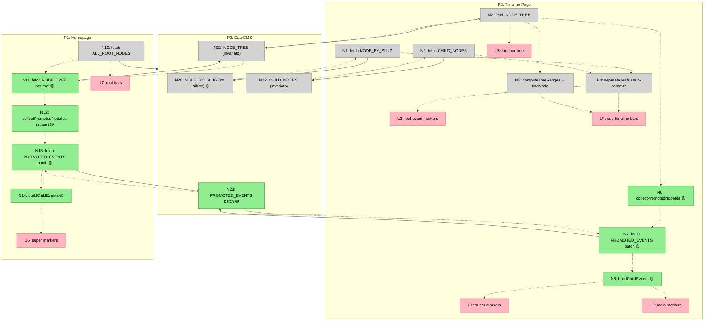

# Propagazione Visibilità Eventi — Shaping

## Source

> Livelli di importanza degli eventi
> Ogni evento ha un livello di visibilità che ne determina la presenza nelle viste superiori:
>
> | Livello | Nome | Visibilità |
> |---------|------|------------|
> | 1 | Evento regolare | Visibile solo all'interno del suo nodo |
> | 2 | Evento principale | Visibile anche nella timeline parent |
> | 3 | Evento super | Visibile a qualsiasi livello della gerarchia |
>
> Esempio per il livello 2:
> Nella timeline delle Assunzioni di DatoCMS ci sono cinque eventi. Quando navigo in quella timeline li vedo tutti. Quando mi trovo nel parent (la timeline generale di DatoCMS), normalmente non li vedo — ma se un'assunzione è marcata come evento principale, rimane visibile anche da lì.
>
> Esempio per il livello 3:
> Sto studiando la storia dell'Impero Romano e ho diverse timeline parallele (Giudei, Egizi, Roma). La nascita di Gesù Cristo è un evento talmente trasversale che dev'essere visibile a qualsiasi livello, anche navigando la storia dell'universo: all'anno zero, quel nodo appare comunque.

> Bug report: nella home timeline non si vedono gli eventi "main" di un figlio quando navigo né nei suoi figli né sulla timeline parent. I "super" dovrebbero essere trasversali a tutto, ma non si vedono.

---

## Problem

La visibilità degli eventi promette una propagazione **gerarchica**: `main` sale di 1 livello, `super` sale ovunque. Ma l'implementazione attuale usa `_allReferencingNodes` di DatoCMS che restituisce solo i **riferimenti diretti** (1 livello). Gli eventi non "salgono" attraverso la gerarchia.

## Outcome

Navigando una timeline a qualsiasi livello, vedo gli eventi che la spec promette: `regular` solo nel contesto locale, `main` anche 1 livello su, `super` a qualsiasi livello ancestor fino alla home.

---

## Requirements (R)

| ID | Requirement | Status |
|----|-------------|--------|
| R0 | Eventi `super` visibili a qualsiasi livello ancestor nella gerarchia | Core goal |
| R1 | Eventi `main` visibili nel parent diretto del loro contesto | Core goal |
| R2 | Eventi `regular` visibili solo nel loro contesto | Core goal (già funziona) |
| R3 | Ogni evento propagato porta con sé il colore del contesto sorgente | Must-have (già funziona) |
| R4 | Query extra accettabili finché non diventano un problema di performance/costi | Nice-to-have |
| R5 | Funziona con alberi fino a 4 livelli di profondità | Must-have |
| R6 | La home (`/`) mostra gli eventi `super` da tutto l'albero | Core goal |
| R7 | Il filtraggio per zoom (`getVisibleEvents`) continua a funzionare sui childEvents | Must-have |

---

## CURRENT: Stato attuale

| Part | Meccanismo | Flag |
|------|-----------|:----:|
| **CUR1** | `_allReferencingNodes` sui figli diretti del nodo corrente — restituisce solo eventi il cui `parent` punta al figlio | |
| **CUR2** | Homepage: `ALL_ROOT_NODES_QUERY` → `_allReferencingNodes(visibility: "super")` sui figli dei root | |
| **CUR3** | Timeline page: `NODE_BY_SLUG_QUERY` → `_allReferencingNodes(visibility: ["super","main"])` sui figli | |
| **CUR4** | `extractChildEvents()` arricchisce con `sourceContextId` + `sourceContextColor` | |
| **CUR5** | `getVisibleEvents()` filtra per zoom (ppy thresholds) sugli eventi diretti, non sui childEvents | |

### Dove si rompe

```
Roma (root, viewing this)
├── Repubblica (child)
│   ├── Guerre Puniche (sub-context)
│   │   └── ⚔️ Battaglia di Canne (super) ← NON VISIBILE da Roma
│   └── 🏛️ Fondazione (main) ← visibile da Roma ✅
└── Impero (child)
```

`_allReferencingNodes` su "Repubblica" restituisce "Fondazione" e "Guerre Puniche", ma **non** "Battaglia di Canne" (il cui parent è "Guerre Puniche", non "Repubblica").

**Raggio effettivo oggi:** 1 livello.
**Raggio atteso per `super`:** N livelli (fino alla root/home).
**Raggio atteso per `main`:** 1 livello (ma verso il parent, non i figli del parent).

---

## A: Deep query con _allReferencingNodes annidati

Annidare `_allReferencingNodes` dentro `_allReferencingNodes` nella query GraphQL, fino a 3-4 livelli.

| Part | Meccanismo | Flag |
|------|-----------|:----:|
| **A1** | Nella `NODE_BY_SLUG_QUERY`, su ogni figlio, annidare `_allReferencingNodes` a 2-3 livelli di profondità | |
| **A2** | Flatten lato client: `extractChildEvents` cammina i livelli annidati e raccoglie tutti gli eventi `super` + `main` (1 livello) | |
| **A3** | Stessa logica per `ALL_ROOT_NODES_QUERY` sulla home | |

**Pro:** Nessuna query aggiuntiva — si espande la query esistente.
**Contro:** La query GraphQL diventa molto grande e verbosa. DatoCMS ha limiti di complessità. Accoppiamento rigido alla profondità massima dell'albero.

---

## B: Query separata "tutti gli eventi super/main dell'albero"

Una query piatta che fetcha tutti gli eventi `super` (e `main` per i figli diretti) dall'intero albero del root node.

| Part | Meccanismo | Flag |
|------|-----------|:----:|
| **B1** | Nuova query `TREE_PROMOTED_EVENTS_QUERY`: `allNodes(filter: { visibility: { in: ["super","main"] } })` filtrata per appartenenza al tree corrente | ⚠️ |
| **B2** | Lato server in `page.tsx`: dopo aver ottenuto il rootId, fetch tutti gli eventi promossi dell'albero | |
| **B3** | Lato client: filtra `super` (tutti) vs `main` (solo quelli il cui parent è figlio diretto del nodo corrente) | |
| **B4** | Riuso di `extractChildEvents` con lista arricchita | |

**Pro:** Una sola query flat, indipendente dalla profondità. Semplice.
**Contro:** DatoCMS non ha un filtro "tutti i discendenti di un nodo" — bisogna filtrare diversamente (⚠️ B1). Potrebbe richiedere fetch di TUTTI gli eventi super/main del sistema e filtrare client-side.

---

## C: Traversal server-side del tree già fetchato ← SELECTED

Usare il `NODE_TREE_QUERY` (che già fetcha l'albero a 4 livelli per la sidebar) per camminare i nodi e raccogliere gli eventi promossi, poi fetch batch dei dettagli.

| Part | Meccanismo | Flag |
|------|-----------|:----:|
| **C1** | `NODE_TREE_QUERY` già fetcha l'albero a 4 livelli con tutti i nodi (id, visibility, color, year, endYear) | |
| **C2** | Nuova funzione `collectPromotedNodeIds(tree, currentNodeId)`: cammina il subtree del nodo corrente, raccoglie gli id dei nodi-evento con visibility `super` a qualsiasi profondità e `main` a profondità 1 (figli dei figli diretti) | |
| **C3** | Batch fetch: query `allNodes(filter: { id: { in: [...ids] } })` con `nodeSummaryFields` per ottenere i dati completi (month, day, tags, image...) | |
| **C4** | Arricchimento con `sourceContextColor`: il parent di ogni evento è già nel tree, si legge il colore da lì | |
| **C5** | Homepage: stessa logica — `NODE_TREE_QUERY` per ogni root (o un tree sintetico), collect super ids, batch fetch | |
| **C5** | Rimuovere `_allReferencingNodes` dalle query esistenti (non più necessario) | |

**Rationale:** Il tree è già fetchato per la sidebar. Zero infrastruttura nuova (niente cache, niente store). Una funzione pura di traversal + una query batch. Indipendente dalla profondità dell'albero.

---

## Fit Check: R × C

| Req | Requirement | Status | C |
|-----|-------------|--------|---|
| R0 | Eventi `super` visibili a qualsiasi livello ancestor | Core goal | ✅ |
| R1 | Eventi `main` visibili nel parent diretto | Core goal | ✅ |
| R2 | Eventi `regular` visibili solo nel loro contesto | Core goal | ✅ |
| R3 | Evento propagato porta colore del contesto sorgente | Must-have | ✅ |
| R4 | Query extra accettabili finché non problema di perf/costi | Nice-to-have | ✅ |
| R5 | Funziona con alberi fino a 4 livelli | Must-have | ✅ |
| R6 | Home mostra `super` da tutto l'albero | Core goal | ✅ |
| R7 | Filtraggio zoom continua a funzionare | Must-have | ✅ |

C passa tutto. R4 rilassato a nice-to-have: una query extra è accettabile.

---

## Detail C: Breadboard

### Places

| # | Place | Description |
|---|-------|-------------|
| P1 | Homepage (`/`) | Vista card + toggle timeline con tutti i root |
| P2 | Timeline Page (`/timeline/[slug]`) | Canvas con eventi, sidebar, detail panel |
| P3 | DatoCMS | Backend GraphQL API |

### UI Affordances

| # | Place | Component | Affordance | Control | Wires Out | Returns To |
|---|-------|-----------|------------|---------|-----------|------------|
| U1 | P2 | TimelineCanvas | event markers (super da subtree) | render | — | — |
| U2 | P2 | TimelineCanvas | event markers (main da figli diretti) | render | — | — |
| U3 | P2 | TimelineCanvas | event markers (leaf events propri) | render | — | — |
| U4 | P2 | TimelineCanvas | sub-timeline bars | render | — | — |
| U5 | P2 | NodeTreeSidebar | albero contesti | render | — | — |
| U6 | P1 | HomeTimelineView | event markers (super da tutti i tree) | render | — | — |
| U7 | P1 | HomeTimelineView | sub-timeline bars (root contexts) | render | — | — |

### Code Affordances — P2: Timeline Page

| # | Place | Component | Affordance | Control | Wires Out | Returns To |
|---|-------|-----------|------------|---------|-----------|------------|
| N1 | P2 | page.tsx | `performRequest(NODE_BY_SLUG_QUERY)` | call | → P3 | → N4, N5 |
| N2 | P2 | page.tsx | `performRequest(NODE_TREE_QUERY)` | call | → P3 | → N5, N6, N7, → U5 |
| N3 | P2 | page.tsx | `performRequest(CHILD_NODES_QUERY)` | call | → P3 | → N4 |
| N4 | P2 | page.tsx | Separate leaf events from sub-contexts | call | — | → U3, U4 |
| N5 | P2 | page.tsx | `computeTreeRanges(rootTree)` + `findNodeInTree` | call | — | → U4 |
| N6 | P2 | tree-utils.ts | **`collectPromotedNodeIds(rootTree, nodeId)`** | call | — | → N7 |
| N7 | P2 | page.tsx | **`performRequest(PROMOTED_EVENTS_QUERY, { ids })`** | call | → P3 | → N8 |
| N8 | P2 | page.tsx | **`buildChildEvents(promotedEvents, parentMap)`** | call | — | → U1, U2 |

### Code Affordances — P1: Homepage

| # | Place | Component | Affordance | Control | Wires Out | Returns To |
|---|-------|-----------|------------|---------|-----------|------------|
| N10 | P1 | page.tsx | `performRequest(ALL_ROOT_NODES_QUERY)` | call | → P3 | → U7, N11 |
| N11 | P1 | page.tsx | **Per ogni root: `performRequest(NODE_TREE_QUERY)`** | call | → P3 | → N12 |
| N12 | P1 | tree-utils.ts | **`collectPromotedNodeIds(tree, rootId)` — solo `super`** | call | — | → N13 |
| N13 | P1 | page.tsx | **`performRequest(PROMOTED_EVENTS_QUERY, { ids })`** | call | → P3 | → N14 |
| N14 | P1 | page.tsx | **`buildChildEvents(promotedEvents, parentMap)`** | call | — | → U6 |

### Code Affordances — P3: DatoCMS

| # | Place | Component | Affordance | Control | Wires Out | Returns To |
|---|-------|-----------|------------|---------|-----------|------------|
| N20 | P3 | DatoCMS | `NODE_BY_SLUG_QUERY` — **senza `_allReferencingNodes`** | query | — | → N1 |
| N21 | P3 | DatoCMS | `NODE_TREE_QUERY` — albero 4 livelli (invariato) | query | — | → N2, N11 |
| N22 | P3 | DatoCMS | `CHILD_NODES_QUERY` — leaf events (invariato) | query | — | → N3 |
| N23 | P3 | DatoCMS | **`PROMOTED_EVENTS_QUERY` — batch by ids con `nodeSummaryFields`** | query | — | → N7, N13 |

### Dettaglio N6: `collectPromotedNodeIds(tree, currentNodeId)`

Logica della funzione pura di traversal:

```
Input:  rootTree (NodeTree, 4 livelli), currentNodeId
Output: { superIds: string[], mainIds: string[] }

1. Trova il nodo corrente nel tree (findNodeInTree)
2. Cammina tutti i discendenti ricorsivamente:
   - Se nodo è foglia (no children) E visibility === "super" → aggiungi a superIds
   - Se nodo è foglia E visibility === "main" E profondità === 1 (nipote diretto) → aggiungi a mainIds
3. Ritorna { superIds, mainIds }
```

Il `parentMap` (già in tree-utils.ts) fornisce il colore del contesto sorgente per ogni evento raccolto.

### Dettaglio N8: `buildChildEvents(promotedEvents, parentMap)`

```
Input:  promotedEvents (NodeSummary[]), parentMap (Map<id, NodeTree>)
Output: ChildEvent[]

Per ogni evento:
1. Trova il parent nel parentMap → ottieni sourceContextId e sourceContextColor
2. Costruisci ChildEvent: { ...event, sourceContextId, sourceContextColor }
```

Sostituisce `extractChildEvents()` che oggi usa `_allReferencingNodes`.

---

### Cosa cambia vs CURRENT

| Componente | CURRENT | Shape C |
|------------|---------|---------|
| `NODE_BY_SLUG_QUERY` | ha `_allReferencingNodes` sui children | **rimuovere** `_allReferencingNodes` |
| `ALL_ROOT_NODES_QUERY` | ha `_allReferencingNodes` sui children | **rimuovere** `_allReferencingNodes` |
| `NODE_TREE_QUERY` | usato solo per sidebar + ranges | **riusato** per traversal promoted events |
| `extractChildEvents()` | legge `_allReferencingNodes` dai children | **sostituito** da `collectPromotedNodeIds` + `buildChildEvents` |
| Nuova query | — | **`PROMOTED_EVENTS_QUERY`**: `allNodes(filter: { id: { in: [...] } })` |
| Nuova funzione | — | **`collectPromotedNodeIds(tree, nodeId)`** in tree-utils.ts |
| Nuova funzione | — | **`buildChildEvents(events, parentMap)`** in child-events.ts |
| Homepage `page.tsx` | 1 query | **+N query** `NODE_TREE_QUERY` (1 per root, in parallelo) + 1 batch |
| Timeline `page.tsx` | 3 query | **3 query** (stesse) + 1 batch = 4 totali |

### Query totali per pagina

| Pagina | CURRENT | Shape C |
|--------|---------|---------|
| Homepage | 1 | 1 + N(roots) + 1 batch = ~6 (con 4 roots) |
| Timeline | 3 | 3 + 1 batch = 4 |



**Legenda:** 🟡 = nuovo o modificato. Nodi verdi nel diagramma = nuovi.

---

## Slicing

### Slice Summary

| # | Slice | Meccanismo | Affordances | Demo |
|---|-------|-----------|-------------|------|
| V1 | Timeline: super+main dal subtree | C1, C2, C3, C4 | N6, N7, N8, N23 + U1, U2 | "Apro /timeline/roma → vedo ⚔️ Battaglia di Canne (super, 3 livelli sotto) con colore Guerre Puniche" |
| V2 | Home: super da tutti i tree | C5 | N11, N12, N13, N14 + U6 | "Homepage timeline → vedo super events da tutti gli alberi, con colore del contesto sorgente" |
| V3 | Cleanup: rimuovi _allReferencingNodes | C6 | N20 (modificato) + rimuovi extractChildEvents | "Tutto funziona come prima, query più leggere, nessuna regressione" |

---

### V1 — Timeline: super+main dal subtree

**Demo:** Apro `/timeline/roma`. Vedo la Battaglia di Canne (evento super, figlio di Guerre Puniche → figlio di Repubblica → figlio di Roma) con il colore di Guerre Puniche. Vedo Fondazione (main) dal contesto Repubblica.

**Affordances aggiunte:**

| # | Component | Affordance | Control | Wires Out | Returns To |
|---|-----------|------------|---------|-----------|------------|
| N6 | tree-utils.ts | `collectPromotedNodeIds(rootTree, nodeId)` | call | — | → N7 |
| N7 | page.tsx | `performRequest(PROMOTED_EVENTS_QUERY, { ids })` | call | → P3 | → N8 |
| N8 | child-events.ts | `buildChildEvents(promotedEvents, parentMap)` | call | — | → U1, U2 |
| N23 | DatoCMS | `PROMOTED_EVENTS_QUERY` — batch by ids | query | — | → N7 |

**File toccati:**

| File | Modifica |
|------|----------|
| `lib/timeline/tree-utils.ts` | + `collectPromotedNodeIds()` |
| `lib/timeline/child-events.ts` | + `buildChildEvents()` |
| `lib/datocms/queries.ts` | + `PROMOTED_EVENTS_QUERY` |
| `app/timeline/[slug]/page.tsx` | Sostituire `extractChildEvents(subContexts)` con il nuovo flusso: collect ids → batch fetch → build |

**Note:** In V1 la vecchia `extractChildEvents` e `_allReferencingNodes` restano nelle query (non si rompe nulla). La timeline page usa il nuovo flusso; la home resta invariata.

---

### V2 — Home: super da tutti i tree

**Demo:** Homepage → toggle Timeline → vedo gli eventi super da tutti gli alberi (Karate, Rock, Music, ecc.) con il colore del contesto sorgente.

**Affordances aggiunte:**

| # | Component | Affordance | Control | Wires Out | Returns To |
|---|-----------|------------|---------|-----------|------------|
| N11 | page.tsx | Per ogni root: `performRequest(NODE_TREE_QUERY)` in parallelo | call | → P3 | → N12 |
| N12 | tree-utils.ts | `collectPromotedNodeIds(tree, rootId)` — solo `super` | call | — | → N13 |
| N13 | page.tsx | `performRequest(PROMOTED_EVENTS_QUERY, { ids })` — batch unico | call | → P3 | → N14 |
| N14 | child-events.ts | `buildChildEvents(promotedEvents, parentMap)` | call | — | → U6 |

**File toccati:**

| File | Modifica |
|------|----------|
| `app/page.tsx` | + fetch `NODE_TREE_QUERY` per ogni root in parallelo, collect super ids, batch fetch, pass childEvents a HomeView |
| `components/home/HomeTimelineView.tsx` | Riceve `childEvents` come prop invece di calcolarlo internamente |

**Note:** Riusa `collectPromotedNodeIds` e `buildChildEvents` da V1. Le query per i tree dei root girano in `Promise.all`.

---

### V3 — Cleanup: rimuovi _allReferencingNodes

**Demo:** Tutto funziona come V1+V2. Le query sono più leggere. Nessuna regressione.

**File toccati:**

| File | Modifica |
|------|----------|
| `lib/datocms/queries.ts` | Rimuovere `_allReferencingNodes` da `NODE_BY_SLUG_QUERY` e `ALL_ROOT_NODES_QUERY` |
| `lib/timeline/child-events.ts` | Rimuovere vecchia `extractChildEvents()` (non più usata) |
| `app/timeline/[slug]/page.tsx` | Rimuovere import/uso di `extractChildEvents` |
| `components/home/HomeTimelineView.tsx` | Rimuovere import/uso di `extractChildEvents` |
