# Trama — Slices

Basato su: Shape A (breadboard.md). 6 slice verticali, ciascuna demo-able.

---

## Slice Summary

| # | Slice | Meccanismi (Shape A) | Demo |
|---|-------|----------------------|------|
| V1 | Homepage con card | A1 | "La homepage mostra le timeline root con card cliccabili" |
| V2 | Timeline page: asse + contesto | A1, A3, A9 | "Apro /timeline/[slug]: vedo l'asse con date adattive e l'header del contesto" |
| V3 | Zoom e pan | A2 | "Scroll → zoom centrato sul cursore; drag → pan; fit-to-view → tutto visibile" |
| V4 | Event markers, visibility, clustering | A4, A5 | "Gli eventi appaiono sulla timeline; zoomando cambiano; i cluster si espandono" |
| V5 | Sidebar, context tree, sub-timeline bars | A6, A7 | "Sidebar navigabile; click nodo → naviga; barre figlie cliccabili" |
| V6 | Event Detail Panel | A8, A9 | "Click evento → panel con tutti i dettagli; X chiude; related cross-contesto naviga" |

---

## V1 — Homepage con card

**Demo:** La homepage carica le timeline root da DatoCMS e le mostra come griglia di card. Ogni card mostra immagine, titolo, range anni, badge conclusa/in corso. Click → naviga a `/timeline/[slug]`.

**Affordances:**

| # | Component | Affordance | Control | Wires Out | Returns To |
|---|-----------|------------|---------|-----------|------------|
| N1 | page.tsx (server) | `fetchRootContexts()` | call | → N50 | → U1 |
| N50 | DatoCMS | `executeQuery(AllRootContexts)` | call | — | → N1 |
| U1 | HomePage | griglia TimelineCard | render | — | — |
| U2 | TimelineCard | featured image + titolo + range + badge | render | — | — |
| U3 | TimelineCard | click card | click | → N13 | — |
| N13 | router | `router.push('/timeline/[slug]')` | call | → S5 | → P2 |

---

## V2 — Timeline page: asse + contesto

**Demo:** Apro `/timeline/[slug]`. La pagina fetcha contesto + eventi da DatoCMS. Il canvas calcola il fit-to-view iniziale e mostra l'asse temporale con label adattive (scala cosmica → storica → moderna). L'header mostra il titolo del contesto e il range.

**Affordances:**

| # | Component | Affordance | Control | Wires Out | Returns To |
|---|-----------|------------|---------|-----------|------------|
| N10 | page.tsx (server) | `fetchContext(slug)` + `fetchContextTree(rootId)` | call | → N51 | → U30 |
| N11 | page.tsx (server) | `fetchEvents(contextId)` | call | → N52 | → N20 |
| N51 | DatoCMS | `executeQuery(ContextTree, {rootId})` | call | — | → N10 |
| N52 | DatoCMS | `executeQuery(EventsByContext, {contextId})` | call | — | → N11 |
| N20 | TimelineCanvas | `computeFitToView(events, softDates)` | call | — | → S3, S4 |
| S3 | — | `viewportStart` (React state) | — | — | → renderPipeline |
| S4 | — | `pixelsPerYear` (React state) | — | — | → renderPipeline |
| N21 | scale.ts | `yearToPixel(year, viewportStart, ppy)` | call | — | → U22 |
| N22 | scale.ts | `getAxisLabels(start, end, width)` | call | — | → U22 |
| U22 | TimelineAxis | asse + tick marks + labels adattive | render | — | — |
| U23 | TimelineAxis | marker "Present" | render | — | — |
| U30 | ContextDetailHeader | intestazione contesto (titolo, range, badge) | render | — | — |

**Note:** In V2 le label dell'asse si adattano alla scala (`getAxisLabels`) ma non c'è ancora interazione. Gli eventi sono fetchati ma non ancora mostrati (arriva in V4).

---

## V3 — Zoom e pan

**Demo:** Scroll con mouse wheel → zoom centrato sul punto del cursore. Drag → pan orizzontale. Pulsante fit-to-view → animazione Framer Motion che riadatta il viewport all'intero range. L'asse si aggiorna in tempo reale.

**Affordances:**

| # | Component | Affordance | Control | Wires Out | Returns To |
|---|-----------|------------|---------|-----------|------------|
| U20 | TimelineCanvas | canvas scroll wheel | scroll | → N25 | — |
| U21 | TimelineCanvas | canvas drag (pointer/touch) | drag | → N26 | — |
| U28 | ZoomControls | zoom+ / zoom- | click | → N25 | — |
| U29 | ZoomControls | fit-to-view | click | → N29 | — |
| N25 | TimelineCanvas | `handleWheel(e)` / zoom btn handler | call | → S3, S4 | — |
| N26 | TimelineCanvas | `usePointerDrag` hook | call | → S3 | — |
| N29 | TimelineCanvas | `fitToView()` — Framer Motion animation | call | → S3, S4 | — |

**Note:** S3 e S4 aggiornati → Canvas Render Pipeline di V2 si riesegue. L'asse mostra le nuove label. Nessun evento ancora.

---

## V4 — Event markers, visibility, clustering

**Demo:** Gli eventi appaiono sulla timeline come punti (evento puntuale) o barre (evento con durata). Zoomando in/out, eventi `regular` appaiono/scompaiono in base alla soglia di visibility. Cluster di eventi vicini mostrano un badge numerico; click sul cluster fa zoom in su quel range.

**Affordances:**

| # | Component | Affordance | Control | Wires Out | Returns To |
|---|-----------|------------|---------|-----------|------------|
| N23 | visibility.ts | `getVisibleEvents(events, ppy)` | call | — | → N24 |
| N24 | TimelineCanvas | `clusterEvents(visible, ppy)` | call | — | → U24, U25, U26 |
| U24 | EventMarker | evento puntuale | render + click | → N27 (stub) | — |
| U25 | EventMarker | evento con durata (barra) | render + click | → N27 (stub) | — |
| U26 | EventCluster | badge cluster (count) | render + click | → N28 | — |
| N28 | TimelineCanvas | `zoomToCluster(cluster)` | call | → S3, S4 | — |

**Note:** N27 (selezione evento) è uno stub in V4 — il click è riconosciuto ma il panel non è ancora implementato. Il panel arriva in V6.

---

## V5 — Sidebar, context tree, sub-timeline bars

**Demo:** La sidebar mostra l'albero dei contesti. Il nodo attivo è evidenziato. Click su un nodo → naviga al contesto (router.push, history entry). Sotto la timeline principale, le sub-timeline figlie appaiono come barre orizzontali colorate; click → naviga. Toggle sidebar: apre/chiude.

**Affordances:**

| # | Component | Affordance | Control | Wires Out | Returns To |
|---|-----------|------------|---------|-----------|------------|
| U10 | Sidebar | pulsante toggle sidebar | click | → N12 | — |
| U11 | ContextTreeItem | nodo (colore + titolo + range) | render | — | — |
| U12 | ContextTreeItem | freccia espandi/collassa | click | local state toggle | — |
| U13 | ContextTreeItem | click nodo | click | → N13 | — |
| N12 | Zustand | `toggleSidebar()` | call | → S2 | — |
| S2 | — | `sidebarOpen` (Zustand) | — | — | → U10 |
| N13 | router | `router.push('/timeline/[slug]')` | call | → S5 | → P2 |
| U27 | SubTimelineBars | barra sub-timeline figlia | render + click | → N30 | — |
| N30 | SubTimelineBars | `router.push('/timeline/[childSlug]')` | call | → S5 | → P2 |

**Note:** Le barre delle sub-timeline usano gli eventi del figlio per calcolare il range; se nessun dato temporale disponibile, la barra non è mostrata (R11/A7.2).

---

## V6 — Event Detail Panel

**Demo:** Click su un evento → il panel slide-in da destra mostra tutti i dettagli (titolo, contesto, data, immagine, rich text, gallery, tag, link, custom fields, eventi correlati). Click X → panel chiuso. Click su related event dello stesso contesto → panel aggiornato. Click su related event di altro contesto → naviga al contesto + panel aperto sul nuovo evento. URL aggiornato con `?event=[slug]` per deep linking. Reload della pagina con URL `?event=` → panel aperto sull'evento corretto.

**Affordances:**

| # | Component | Affordance | Control | Wires Out | Returns To |
|---|-----------|------------|---------|-----------|------------|
| N27 | Zustand | `setSelectedEvent(id)` | call | → S1, → S5 | — |
| S1 | — | `selectedEventId` (Zustand) | — | — | → U40 |
| S5 | — | Browser URL `?event=[slug]` | — | — | — |
| N11b | layout client | `initEventFromProp(slug)` su mount | call | → N27 | — |
| U40 | EventDetailPanel | panel slide-in (Framer Motion) | render | → N40 | — |
| N40 | EventDetailPanel | `fetchEventDetail(eventId)` | call | → N53 | → U42..U46 |
| N53 | DatoCMS | `executeQuery(EventDetail, {eventId})` | call | — | → N40 |
| U41 | EventDetailPanel | bottone chiudi (X) | click | → N41 | — |
| N41 | Zustand | `clearSelectedEvent()` | call | → S1, → S5 | — |
| U42 | EventDetailPanel | titolo + badge contesto + data + durata | render | — | — |
| U43 | DatoImage | featured image | render | — | — |
| U44 | DatoStructuredText | descrizione rich text | render | — | — |
| U45 | EventDetailPanel | gallery + tags + links + custom fields | render | — | — |
| U46 | RelatedEventsList | lista eventi correlati | render | — | — |
| U47 | RelatedEventsList | click related (stesso contesto) | click | → N27 | — |
| U48 | RelatedEventsList | click related (altro contesto) | click | → N42 | — |
| N42 | RelatedEventsList | `router.push('/timeline/[slug]?event=[slug]')` | call | → S5 | → P2 |

---

## Breadboard sliced

```mermaid
flowchart TB

subgraph P1["P1: Homepage"]
    N1["N1: fetchRootContexts"]
    N50["N50: AllRootContexts"]
    U1["U1: griglia card"]
    U2["U2: card"]
    U3["U3: click card"]
    N13_P1["N13: router.push"]
end

subgraph P2["P2: Timeline Page"]
    N10["N10: fetchContext+Tree"]
    N11["N11: fetchEvents"]
    N51["N51: ContextTree"]
    N52["N52: EventsByContext"]
    N11b["N11b: initEventFromProp"]
    S1["S1: selectedEventId"]
    S2["S2: sidebarOpen"]
    S5["S5: Browser URL"]

    subgraph P2_1["P2.1: Sidebar"]
        U10["U10: toggle sidebar"]
        U11["U11: nodo"]
        U12["U12: espandi/collassa"]
        U13["U13: click nodo"]
        N12["N12: toggleSidebar"]
        N13_sb["N13: router.push"]
    end

    subgraph P2_2["P2.2: Canvas"]
        U30["U30: ContextDetailHeader"]
        U20["U20: scroll wheel"]
        U21["U21: drag"]
        U28["U28: zoom±"]
        U29["U29: fit-to-view"]
        N20["N20: computeFitToView"]
        N25["N25: handleWheel/Btn"]
        N26["N26: usePointerDrag"]
        N28["N28: zoomToCluster"]
        N29["N29: fitToView+FM"]
        S3["S3: viewportStart"]
        S4["S4: pixelsPerYear"]
        renderPipeline[["RENDER PIPELINE\nN21·N22·N23·N24\n→ U22·U23·U24·U25·U26·U27"]]
        U26["U26: cluster badge"]
        U27["U27: subtimeline bar"]
        N30["N30: router.push(child)"]
        N27["N27: setSelectedEvent"]
    end

    subgraph P2_3["P2.3: Event Detail Panel"]
        U40["U40: panel slide-in"]
        U41["U41: chiudi X"]
        U42_46["U42-46: dettagli evento"]
        U46["U46: related events"]
        U47["U47: related stesso ctx"]
        U48["U48: related altro ctx"]
        N40["N40: fetchEventDetail"]
        N41["N41: clearSelectedEvent"]
        N42["N42: router.push(altro ctx)"]
        N53["N53: EventDetail"]
    end
end

N1 --> N50 --> N1
N1 -.-> U1
U3 --> N13_P1 --> S5 --> P2
N10 --> N51 --> N10
N11 --> N52 --> N11
N10 -.-> U30
N11 -.-> N20
N20 --> S3 & S4
S3 & S4 --> renderPipeline
N11 -.-> renderPipeline
U20 --> N25
U28 --> N25
N25 --> S3 & S4
U21 --> N26 --> S3
U29 --> N29 --> S3 & S4
U26 --> N28 --> S3 & S4
U10 --> N12 --> S2
U13 --> N13_sb --> S5
U27 --> N30 --> S5
renderPipeline -.->|click| N27
N27 --> S1 & S5
S1 -.-> U40
N11b --> N27
U40 --> N40 --> N53 --> N40
N40 -.-> U42_46 & U46
U41 --> N41 --> S1 & S5
U47 --> N27
U48 --> N42 --> S5

%% Colori per slice
classDef v1 fill:#fce4ec,stroke:#e91e63,color:#000
classDef v2 fill:#e8f5e9,stroke:#4caf50,color:#000
classDef v3 fill:#e3f2fd,stroke:#2196f3,color:#000
classDef v4 fill:#fff3e0,stroke:#ff9800,color:#000
classDef v5 fill:#f3e5f5,stroke:#9c27b0,color:#000
classDef v6 fill:#fff8e1,stroke:#ffc107,color:#000
classDef chunk fill:#b3e5fc,stroke:#0288d1,color:#000,stroke-width:2px
classDef store fill:#e6e6fa,stroke:#9370db,color:#000

class N1,N50,U1,U2,U3,N13_P1 v1
class N10,N11,N51,N52,N20,S3,S4,N21,N22,U22,U23,U30 v2
class U20,U21,U28,U29,N25,N26,N29 v3
class N23,N24,U24,U25,U26,N28 v4
class U10,U11,U12,U13,N12,S2,N13_sb,U27,N30 v5
class N27,S1,S5,N11b,U40,U41,U42_46,U46,U47,U48,N40,N41,N42,N53 v6
class renderPipeline chunk
```

**Legenda colori:**
- 🩷 **V1** Homepage
- 💚 **V2** Asse + contesto
- 💙 **V3** Zoom e pan
- 🧡 **V4** Event markers
- 💜 **V5** Sidebar + sub-timeline
- 💛 **V6** Event Detail Panel
