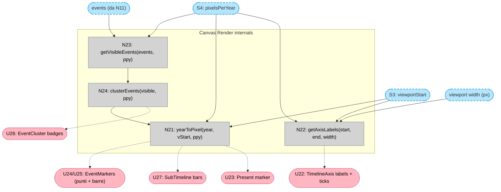

# Timeo — Breadboard (Shape A)

---

## Places

| # | Place | Description |
|---|-------|-------------|
| P1 | Homepage | Lista delle timeline root — punto di ingresso |
| P2 | Timeline Page | Pagina principale: sidebar + canvas + detail panel |
| P2.1 | Sidebar | Subplace: albero contesti navigabile |
| P2.2 | Timeline Canvas | Subplace: asse temporale con zoom e pan |
| P2.3 | Event Detail Panel | Subplace: aside destro con dettaglio evento |
| P3 | DatoCMS API | Backend GraphQL (headless CMS) |

---

## UI Affordances

| # | Place | Component | Affordance | Control | Wires Out | Returns To |
|---|-------|-----------|------------|---------|-----------|------------|
| U1 | P1 | HomePage | griglia TimelineCard | render | — | — |
| U2 | P1 | TimelineCard | featured image + titolo + range + badge | render | — | — |
| U3 | P1 | TimelineCard | click card | click | → N13 | — |
| U10 | P2.1 | Sidebar | pulsante toggle sidebar | click | → N12 | — |
| U11 | P2.1 | ContextTreeItem | nodo (colore + titolo + range) | render | — | — |
| U12 | P2.1 | ContextTreeItem | freccia espandi/collassa | click | local state toggle | — |
| U13 | P2.1 | ContextTreeItem | click nodo | click | → N13 | — |
| U20 | P2.2 | TimelineCanvas | canvas scroll wheel | scroll | → N25 | — |
| U21 | P2.2 | TimelineCanvas | canvas drag (pointer/touch) | drag | → N26 | — |
| U22 | P2.2 | TimelineAxis | asse + tick marks + labels adattive | render | — | — |
| U23 | P2.2 | TimelineAxis | marker "Present" | render | — | — |
| U24 | P2.2 | EventMarker | evento puntuale | render + click | → N27 | — |
| U25 | P2.2 | EventMarker | evento con durata (barra) | render + click | → N27 | — |
| U26 | P2.2 | EventCluster | badge cluster (count) | render + click | → N28 | — |
| U27 | P2.2 | SubTimelineBars | barra sub-timeline figlia | render + click | → N30 | — |
| U28 | P2.2 | ZoomControls | zoom+ / zoom- | click | → N25 | — |
| U29 | P2.2 | ZoomControls | fit-to-view | click | → N29 | — |
| U30 | P2.2 | ContextDetailHeader | intestazione contesto (titolo, range, badge) | render | — | — |
| U40 | P2.3 | EventDetailPanel | panel slide-in (Framer Motion) | render | — | — |
| U41 | P2.3 | EventDetailPanel | bottone chiudi (X) | click | → N41 | — |
| U42 | P2.3 | EventDetailPanel | titolo + badge contesto + data + durata | render | — | — |
| U43 | P2.3 | DatoImage | featured image | render | — | — |
| U44 | P2.3 | DatoStructuredText | descrizione rich text | render | — | — |
| U45 | P2.3 | EventDetailPanel | gallery + tags + links + custom fields | render | — | — |
| U46 | P2.3 | RelatedEventsList | lista eventi correlati | render | — | — |
| U47 | P2.3 | RelatedEventsList | click evento correlato (stesso contesto) | click | → N27 | — |
| U48 | P2.3 | RelatedEventsList | click evento correlato (altro contesto) | click | → N42 | — |

---

## Code Affordances

| # | Place | Component | Affordance | Control | Wires Out | Returns To |
|---|-------|-----------|------------|---------|-----------|------------|
| N1 | P1 | page.tsx (server) | `fetchRootContexts()` | call | → N50 | → U1 |
| N10 | P2 | page.tsx (server) | `fetchContext(slug)` + `fetchContextTree(rootId)` | call | → N51 | → U11, U30 |
| N11 | P2 | page.tsx (server) | `fetchEvents(contextId)` | call | → N52 | → N20, N23 |
| N11b | P2 | layout client | `initEventFromProp(slug)` su mount — legge `searchParams.event` passato dal server | call | → N27 | — |
| N12 | P2.1 | Zustand | `toggleSidebar()` | call | → S2 | — |
| N13 | P2.1 / P2.2 | Next.js router | `router.push('/timeline/[slug]')` | call | → S5 | → P2 |
| N20 | P2.2 | TimelineCanvas | `computeFitToView(events, softDates)` | call | — | → S3, S4 |
| N21 | P2.2 | scale.ts | `yearToPixel(year, viewportStart, ppy)` | call | — | → U22, U24, U25, U27 |
| N22 | P2.2 | scale.ts | `getAxisLabels(start, end, width)` | call | — | → U22 |
| N23 | P2.2 | visibility.ts | `getVisibleEvents(events, ppy)` | call | — | → N24 |
| N24 | P2.2 | TimelineCanvas | `clusterEvents(visible, ppy)` | call | — | → U24, U25, U26 |
| N25 | P2.2 | TimelineCanvas | `handleWheel(e)` / zoom btn handler | call | → S3, S4 | — |
| N26 | P2.2 | TimelineCanvas | `usePointerDrag` hook | call | → S3 | — |
| N27 | P2.2 | Zustand | `setSelectedEvent(id)` | call | → S1, → S5 | — |
| N28 | P2.2 | TimelineCanvas | `zoomToCluster(cluster)` | call | → S3, S4 | — |
| N29 | P2.2 | TimelineCanvas | `fitToView()` — Framer Motion animation | call | → S3, S4 | — |
| N30 | P2.2 | SubTimelineBars | `router.push('/timeline/[childSlug]')` | call | → S5 | → P2 |
| N40 | P2.3 | EventDetailPanel | `fetchEventDetail(eventId)` — client fetch | call | → N53 | → U42, U43, U44, U45, U46 |
| N41 | P2.3 | Zustand | `clearSelectedEvent()` | call | → S1, → S5 | — |
| N42 | P2.3 | RelatedEventsList | `router.push('/timeline/[slug]?event=[slug]')` | call | → S5 | → P2 |
| N50 | P3 | DatoCMS | `executeQuery(AllRootContexts)` | call | — | → N1 |
| N51 | P3 | DatoCMS | `executeQuery(ContextTree, {rootId})` | call | — | → N10 |
| N52 | P3 | DatoCMS | `executeQuery(EventsByContext, {contextId})` | call | — | → N11 |
| N53 | P3 | DatoCMS | `executeQuery(EventDetail, {eventId})` | call | — | → N40 |

---

## Data Stores

| # | Place | Store | Description |
|---|-------|-------|-------------|
| S1 | P2 | `selectedEventId` (Zustand) | ID evento selezionato — `null` se panel chiuso |
| S2 | P2 | `sidebarOpen` (Zustand) | Stato aperto/chiuso della sidebar |
| S3 | P2.2 | `viewportStart` (React state) | Anno al bordo sinistro del viewport |
| S4 | P2.2 | `pixelsPerYear` (React state) | Fattore di zoom corrente |
| S5 | — | Browser URL | `/timeline/[slug]?event=[eventSlug]` |

---

## Mermaid

```mermaid
flowchart TB

%% ─── P1: Homepage ───────────────────────────────────────────
subgraph P1["P1: Homepage"]
    N1["N1: fetchRootContexts()"]
    U1["U1: griglia TimelineCard"]
    U2["U2: card (image + titolo + range + badge)"]
    U3["U3: click card"]
end

%% ─── P3: DatoCMS ────────────────────────────────────────────
subgraph P3["P3: DatoCMS API"]
    N50["N50: AllRootContexts"]
    N51["N51: ContextTree"]
    N52["N52: EventsByContext"]
    N53["N53: EventDetail"]
end

%% ─── Router ─────────────────────────────────────────────────
N13["N13: router.push(timeline/slug)"]
S5["S5: Browser URL"]

%% ─── P2: Timeline Page ──────────────────────────────────────
subgraph P2["P2: Timeline Page"]
    N10["N10: fetchContext + Tree (server)"]
    N11["N11: fetchEvents (server)"]
    N11b["N11b: initEventFromProp (mount)"]
    S1["S1: selectedEventId (Zustand)"]
    S2["S2: sidebarOpen (Zustand)"]

    %% P2.1: Sidebar
    subgraph P2_1["P2.1: Sidebar"]
        U10["U10: toggle sidebar"]
        U11["U11: nodo contesto"]
        U12["U12: freccia espandi/collassa"]
        U13["U13: click nodo"]
        N12["N12: toggleSidebar()"]
    end

    %% P2.2: Timeline Canvas
    subgraph P2_2["P2.2: Timeline Canvas"]
        U30["U30: ContextDetailHeader"]
        U20["U20: scroll wheel"]
        U21["U21: drag"]
        U28["U28: zoom+ / zoom-"]
        U29["U29: fit-to-view"]
        U26["U26: EventCluster badge"]
        U27["U27: SubTimeline bar"]

        N20["N20: computeFitToView()"]
        N25["N25: handleWheel / zoomBtn"]
        N26["N26: usePointerDrag"]
        N27["N27: setSelectedEvent()"]
        N28["N28: zoomToCluster()"]
        N29["N29: fitToView() + FM"]
        N30["N30: router.push(child)"]

        renderPipeline[["CHUNK: Canvas Render\n(N21 yearToPixel · N22 getAxisLabels\nN23 getVisibleEvents · N24 clusterEvents\n→ U22 axis · U23 present · U24/25 events · U26/27)"]]

        S3["S3: viewportStart"]
        S4["S4: pixelsPerYear"]
    end

    %% P2.3: Event Detail Panel
    subgraph P2_3["P2.3: Event Detail Panel"]
        U40["U40: panel slide-in"]
        U41["U41: chiudi X"]
        U42["U42: titolo + contesto + data"]
        U43["U43: image"]
        U44["U44: descrizione"]
        U45["U45: media + tags + links"]
        U46["U46: related events"]
        U47["U47: click related (stesso ctx)"]
        U48["U48: click related (altro ctx)"]
        N40["N40: fetchEventDetail()"]
        N41["N41: clearSelectedEvent()"]
        N42["N42: router.push(altro ctx + event)"]
    end
end

%% ─── Flussi Homepage ────────────────────────────────────────
N1 --> N50
N50 -.-> N1
N1 -.-> U1
U3 --> N13

%% ─── Navigazione → Timeline Page ───────────────────────────
N13 --> S5
S5 -.-> P2
N10 --> N51
N51 -.-> N10
N10 -.-> U11
N10 -.-> U30
N11 --> N52
N52 -.-> N11
N11 -.-> N20
N11 -.-> renderPipeline

%% ─── Viewport init ──────────────────────────────────────────
N20 --> S3
N20 --> S4

%% ─── Canvas Render Pipeline ─────────────────────────────────
S3 --> renderPipeline
S4 --> renderPipeline

%% ─── Zoom / Pan ─────────────────────────────────────────────
U20 --> N25
U28 --> N25
N25 --> S3
N25 --> S4
U21 --> N26
N26 --> S3
U26 --> N28
N28 --> S3
N28 --> S4
U29 --> N29
N29 --> S3
N29 --> S4

%% ─── Navigazione sidebar ────────────────────────────────────
U10 --> N12
N12 --> S2
U13 --> N13
U27 --> N30
N30 --> S5

%% ─── Selezione evento ───────────────────────────────────────
renderPipeline -.->|click evento| N27
N27 --> S1
N27 --> S5
S1 -.-> U40

%% ─── Event Detail Panel ─────────────────────────────────────
N11b --> N27
U40 --> N40
N40 --> N53
N53 -.-> N40
N40 -.-> U42
N40 -.-> U43
N40 -.-> U44
N40 -.-> U45
N40 -.-> U46
U41 --> N41
N41 --> S1
N41 --> S5
U47 --> N27
U48 --> N42
N42 --> S5

%% ─── Stili ──────────────────────────────────────────────────
classDef ui fill:#ffb6c1,stroke:#d87093,color:#000
classDef nonui fill:#d3d3d3,stroke:#808080,color:#000
classDef store fill:#e6e6fa,stroke:#9370db,color:#000
classDef chunk fill:#b3e5fc,stroke:#0288d1,color:#000,stroke-width:2px

class U1,U2,U3,U10,U11,U12,U13,U20,U21,U22,U23,U24,U25,U26,U27,U28,U29,U30 ui
class U40,U41,U42,U43,U44,U45,U46,U47,U48 ui
class N1,N10,N11,N11b,N12,N13,N20,N25,N26,N27,N28,N29,N30 nonui
class N40,N41,N42,N50,N51,N52,N53 nonui
class S1,S2,S3,S4,S5 store
class renderPipeline chunk
```

---

## Canvas Render — Chunk detail

